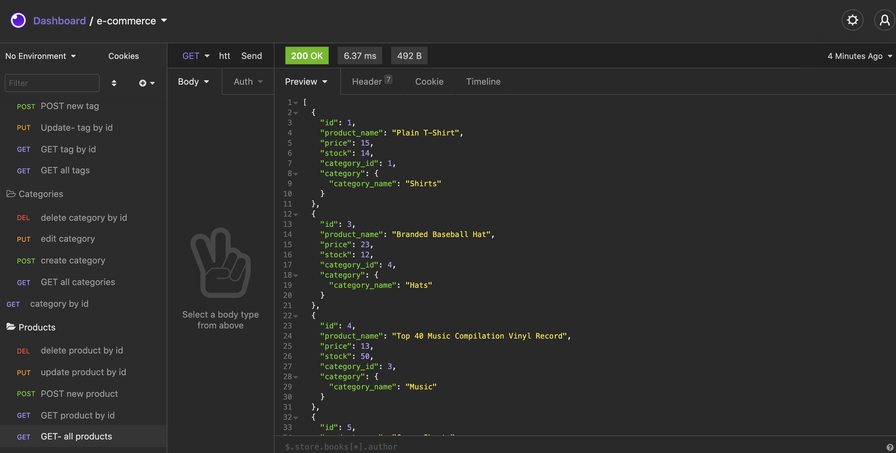

# E-Commerce 

## Description
Internet retail, also known as e-commerce, is the largest sector of the electronics industry, having generated an estimated US$29 trillion in 2017 (Source: United Nations Conference on Trade and Development). E-commerce platforms like Shopify and WooCommerce provide a suite of services to businesses of all sizes. Due to the prevalence of these platforms, I was tasked to complete the back-end of this E-commerce, in order to understand the fundamental architecture of e-commerce sites. This is a back-end application, where all CRUD operations can be tested using Insomnia Core, and would be ready to connect to a front-end. 

## Installation
Make sure you have `node` installed. Open up the project in VSCode, and open up the terminal. Make sure that you are the at the root directory of the project and run the command `npm start` in the terminal to start the server. Use `Insomnia Core` to test the API routes.

## Usage

You can view a more detailed walkthrough video [here](https://drive.google.com/file/d/1uYfLKilwxIJcGe0K58pdE1AyoGb7QGt0/view).

## Built With

* Node.js
* mySQL
* JavaScript
* Sequelize.js
* Insomnia Core
* RESTful APIs

## Credits
Big thanks to the Upenn LPS Coding Bootcamp Instructional staff, and my tutor for all the support. 

## Questions
If you have any questions, feel free to email me at [akelstrom@gmail.com](mailto:akelstrom@gmail.com).
